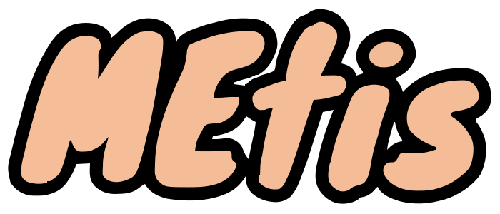

[English](README.md) | [简体中文](README-zh.md)

<div align="center">
  
  <p><b>一个兼具美感与高度可定制性的浏览器起始页。</b></p>
</div>

---

## 核心特性

- **毛玻璃设计 UI**：优美、现代的半透明磨砂玻璃界面。
- **自定义搜索引擎**：轻松管理您最喜爱的搜索引擎，支持拖拽排序，并通过 UI 界面随时添加自定义引擎。
- **组件与时钟设置**：深度定制时钟字体风格、大小以及各类桌面组件。
- **动态壁纸与主题**：支持本地上传、外部链接或预设壁纸库。无缝切换深色/浅色模式。
- **隐私至上**：完全基于本地运行。无任何跟踪或数据收集，所有设置项均安全存储在您的本地浏览器中。

## 快速开始

### 环境要求

请确保您的设备上已安装 Node.js。

```bash
node -v
npm -v
```

### 安装与运行

1. 克隆本仓库：
```bash
git clone https://github.com/YourUsername/Metis.git
cd Metis
```

2. 安装依赖：
```bash
npm install
```

3. 启动开发服务器：
```bash
npm run dev
```

4. 构建生产版本：
```bash
npm run build
```

## 开源许可证

Metis 是遵循 [Apache-2.0 License](LICENSE) 协议的开源软件。
